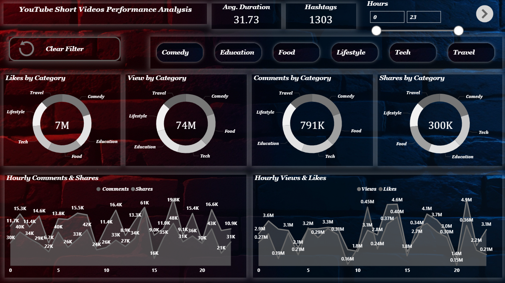

# YouTube Shorts Performance Analysis Dashboard

A Power BI dashboard built to analyze YouTube Shorts performance using metrics like views, likes, comments, shares, categories, and hourly trends.
This project helps creators understand which content works best and the ideal posting time to maximize engagement.

## 📌 Key Features

- Category-wise performance (Likes, Views, Comments, Shares)
- Hourly Engagement Trends
- Interactive filters (Category, Hours)
- KPIs: Avg. Duration, Hashtag Count
- Clean dark-themed UI
- Built using Power BI

## 📊 Dashboard Preview

## 📁 Dataset

- youtube_shorts_performance_dataset.csv
- Contains: views, likes, comments, shares, duration, categories, hashtags, upload hours etc.

## 🧠 Insights Extracted

- Best posting time: 2 PM to 5 PM
- Top performing categories: Comedy & Tech
- Highest shares: Lifestyle & Food
- Avg. video duration: ~31 seconds
- Highly engaging posting hours: 13:00–17:00

## 🧑‍💻 Tools Used

- Power BI Desktop
- Power Query (for transformations)

## 📦 Files Included
| File | Description |
|----------------|--------------|
| `Youtube_Perfromance.pbix` | Dashboard File |
| `youtube_shorts_performance_dataset.csv' | Data |
| `Youtube_Dashboard.png`| Dashboard image |
| `README.md` |  Project overview & summary |

## 🚀 How to Explore
**1.** Download the .pbix file
**2.** Open it in Power BI Desktop
**3.** Load the dataset if path differs
**4.** Interact with filters and charts

## ⭐ About This Project

This dashboard was created to analyze YouTube Shorts engagement and identify performance patterns.
Useful for:

- Content creators
- Social media marketers
- Data analysis learners
- Portfolio showcase

## 👨‍💻 Author
**Ravi Kumar Gupta**  
📍 Delhi, India  

